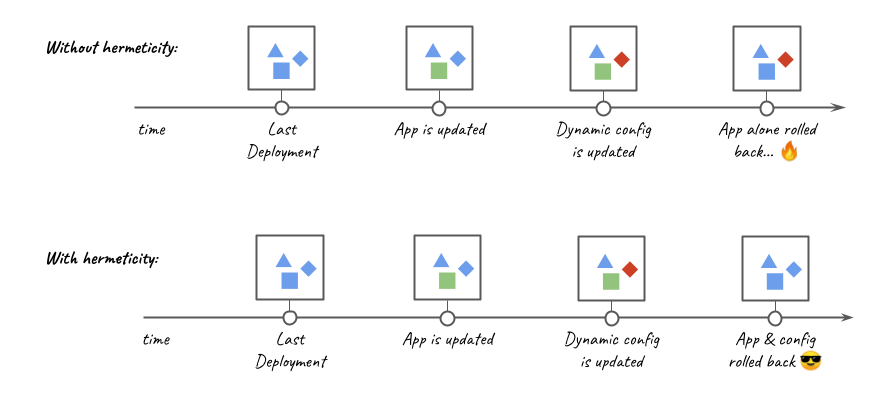
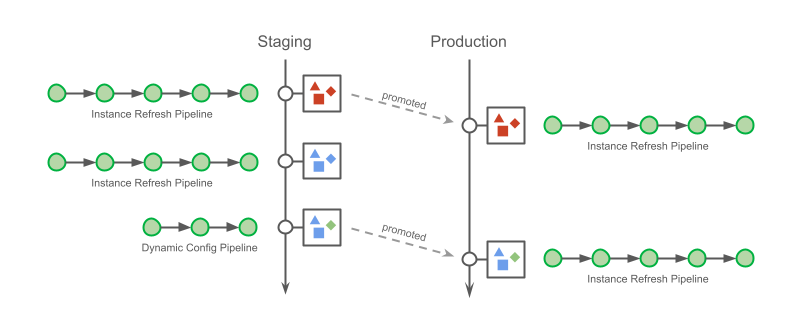
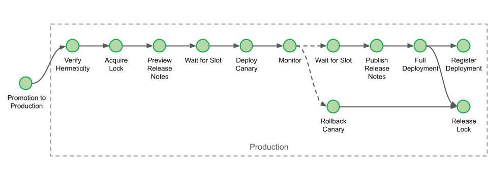
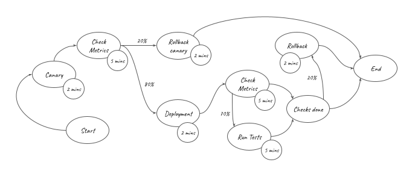
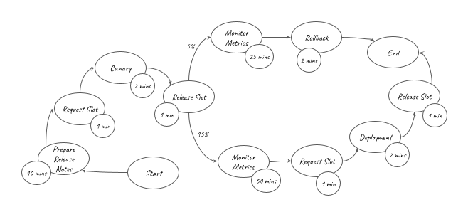

[In the first part of this blog post](https://engineering.grab.com/our-journey-to-continuous-delivery-at-grab), you've read about the improvements made to our build and staging deployment process, and how plenty of manual tasks routinely taken by engineers have been automated with _Conveyor_: an in-house continuous delivery solution.

This new post begins with the introduction of the hermeticity principle for our deployments, and how it improves the confidence with promoting changes to production. Changes sent to production via Conveyor's deployment pipelines are then described in detail.

<figure>
   <figcaption align="middle"><i>Overview of Grab delivery process</i></figcaption>
  </figure>

Finally, looking back at the engineering efficiency improvements around velocity and reliability over the last 2 years, we answer the big question - was the investment on a custom continuous delivery solution like Conveyor the right decision for Grab?

## Improving Confidence in our Production Deployments with Hermeticity

The term _deployment hermeticity_ is borrowed from build systems. A build system is called hermetic if builds always produce the same artefacts regardless of changes in the environment they run on. Similarly, we call our deployments hermetic if they always result in the same deployed artefacts regardless of the environment's change or the number of times they are executed.

The behaviour of a service is rarely controlled by a single variable. The application that makes up your service is an important driver of its behaviour, but its configuration is an important contributor, for example. The behaviour for traditional microservices at Grab is dictated mainly by 3 versioned artefacts: application code, static and dynamic configuration.

<figure>
  </figure>

Conveyor has been integrated with the systems that operate changes in each of these parameters. By tracking all 3 parameters at every deployment, Conveyor can reproducibly deploy microservices with similar behaviour: its deployments are hermetic.

Building upon this property, Conveyor can ensure that all deployments made to production have been tested before with the same combination of parameters. This is valuable to us:

*   An outcome of staging deployments for a specific set of parameters is a good predictor of outcomes in production deployments for the same set of parameters and thus it makes testing in staging more relevant.
*   Rollbacks are hermetic; we never rollback to a combination of parameters that has not been used previously.

In the past, incidents had resulted from an application rollback not compatible with the current dynamic configuration version; this was aggravating since rollbacks are expected to be a safe recovery mechanism. The introduction of hermetic deployments has largely eliminated this category of problems.

Hermeticity is maintained by registering the deployment parameters as artefacts after each successfully completed pipeline. Users must then select one of the registered deployment metadata to promote to production.

At this point, you might be wondering: why not use a single pipeline that includes both staging and production deployments? This was indeed how it started, with a single pipeline spanning multiple environments. However, engineers soon complained about it.

The most obvious reason for the complaint was that less than 20% of changes deployed in staging will make their way to production. This meant that engineers would have toil associated with each completed staging deployment since the pipeline must be manually cancelled rather than continued to production.

The other reason is that this multi-environment pipeline approach reduced flexibility when promoting changes to production. There are different ways to apply changes to a cluster. For example, lengthy pipelines that refresh instances can be used to deploy any combination of changes, while there are quicker pipelines restricted to dynamic configuration changes (such as feature flags rollouts). Regardless of the order in which the changes are made and how they are applied, Conveyor tracks the change.

Eventually, engineers promote a deployment artefact to production. However they do not need to apply changes in the same sequence with which were applied to staging. Furthermore, to prevent erroneous actions, Conveyor presents only changes that can be applied with the requested pipeline (and sometimes, no changes are available). Not being forced into a specific method of deploying changes is one of added benefits of hermetic deployments.

## Returning to Our Journey Towards Engineering Efficiency

If you can recall, the first part of this blog post series ended with a description of staging deployment. Our deployment to production starts with a verification that we uphold our hermeticity principle, as explained above.

Our production deployment pipelines can run for several hours for large clusters with rolling releases (few run for days), so we start by acquiring locks to ensure there are no concurrent deployments for any given cluster.

Before making any changes to the environment, we automatically generate release notes, giving engineers a chance to abort if the wrong set of changes are sent to production.

The pipeline next waits for a deployment slot. Early on, engineers adopted deployment windows that coincide with office hours, such that if anything goes wrong, there is always someone on hand to help. Prior to the introduction of Conveyor, however, engineers would manually ask a Slack bot for approval. This interaction is now automated, and the only remaining action left is for the engineer to approve that the deployment can proceed via a single click, in line with our hands-off deployment principle.

When the canary is in production, Conveyor automates monitoring it. This process is similar to the one already discussed [in the first part of this blog post](https://engineering.grab.com/our-journey-to-continuous-delivery-at-grab): Engineers can configure a set of alerts that Conveyor will keep track of. As soon as any one of the alerts is triggered, Conveyor automatically rolls back the service.

If no alert is raised for the duration of the monitoring period, Conveyor waits again for a deployment slot. It then publishes the release notes for that deployment and completes the deployments for the cluster. After the lock is released and the deployment registered, the pipeline finally comes to its successful completion.

## Benefits of Our Journey Towards Engineering Efficiency

All these improvements made over the last 2 years have reduced the effort spent by engineers on deployment while also reducing the failure rate of our deployments.

If you are an engineer working on DevOps in your organisation, you know how hard it can be to measure the impact you made on your organisation. To estimate the time saved by our pipelines, we can model the activities that were previously done manually with a rudimentary weighted graph. In this graph, each edge carries a probability of the activity being performed (100% when unspecified), while each vertex carries the time taken for that activity.

Focusing on our regular staging deployments only, such a graph would look like this:

The overall amount of effort automated by the staging pipelines () is represented in the graph above. It can be converted into the equation below:

This equation shows that for each staging deployment, around 16 minutes of work have been saved. Similarly, for regular production deployments, we find that 67 minutes of work were saved for each deployment:

Moreover, efficiency was not the only benefit brought by the use of deployment pipelines for our traditional microservices. Surprisingly perhaps, the rate of failures related to production changes is progressively reducing while the amount of production changes that were made with Conveyor increased across the organisation (starting at 1.5% of failures per deployments, and finishing at 0.3% on average over the last 3 months for the period of data collected):

## Keep Calm and Automate

Since the first draft for this post was written, we've made many more improvements to our pipelines. We've begun automating Database Migrations; we've extended our set of hermetic variables to Amazon Machine Image (AMI) updates; and we're working towards supporting container deployments.

Through automation, all of Conveyor's deployment pipelines have contributed to save more than 5,000 man-days of efforts in 2020 alone, across all supported teams. That's around 20 man-years worth of effort, which is around 3 times the capacity of the team working on the project! Investments in our automation pipelines have more than paid for themselves, and the gains go up every year as more workflows are automated and more teams are onboarded.

If Conveyor has saved efforts for engineering teams, has it then helped to improve velocity? I had opened the first part of this blog post with figures on the deployment funnel for microservice teams at Grab, towards the end of 2018. So where do the figures stand today for these teams?

In the span of 2 years, the average number of build and staging deployment performed each day has not varied much. However, in the last 3 months of 2020, engineers have sent twice more changes to production than they did for the same period in 2018.

Perhaps the biggest recognition received by the team working on the project, was from Grab's engineers themselves. In the 2020 internal NPS survey for engineering experience at Grab, Conveyor received the highest score of any tools (built in-house or not).

---

<small class="credits">All these improvements in efficiency for our engineers would never have been possible without the hard work of all team members involved in the project, past and present: Tanun Chalermsinsuwan, Aufar Gilbran, Deepak Ramakrishnaiah, Repon Kumar Roy (Kowshik), Su Han, Voislav Dimitrijevikj, Stanley Goh, Htet Aung Shine, Evan Sebastian, Qijia Wang, Oscar Ng, Jacob Sunny, Subhodip Mandal and many others who have contributed and collaborated with them.</small>

---

## Join Us

Grab is the leading superapp platform in Southeast Asia, providing everyday services that matter to consumers. More than just a ride-hailing and food delivery app, Grab offers a wide range of on-demand services in the region, including mobility, food, package and grocery delivery services, mobile payments, and financial services across 428 cities in eight countries.

Powered by technology and driven by heart, our mission is to drive Southeast Asia forward by creating economic empowerment for everyone. If this mission speaks to you, [join our team](https://grab.careers/) today!
